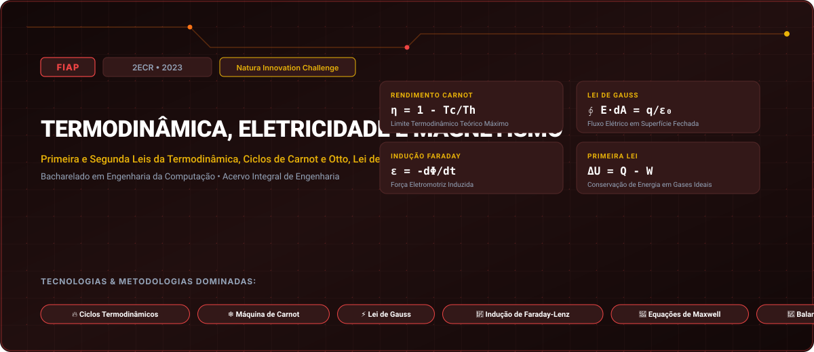

# FIAP • Termodinâmica, Eletricidade e Magnetismo (2023)

> **Engenharia da Computação — FIAP (Faculdade de Informática e Administração Paulista)**  
> **Turma:** 2ECR • Ano Letivo 2023  
> **Desafio Corporativo Integrado:** Natura Innovation Challenge  
> **Portal Interativo GitHub Pages:** [https://guimemee.github.io/fiap-termodinamica-eletricidade-e-magnetismo/](https://guimemee.github.io/fiap-termodinamica-eletricidade-e-magnetismo/)

---

## 📋 Sumário Executivo do Acervo

Este repositório consolida o acervo acadêmico integral e os projetos práticos de engenharia da disciplina **Termodinâmica, Eletricidade e Magnetismo**, contemplando:
1. **6 Checkpoints Oficiais (2023):** Enunciados integrais originais, memórias de cálculo passo a passo no padrão Symbolab e cadernos Jupyter (`.ipynb`) com gráficos executáveis.
2. **01_Apostilas_e_Teoria:** Livros didáticos, apostilas e slides de aulas.
3. **02_Exercicios_e_Laboratorios:** Listas práticas, scripts e códigos de laboratório.
4. **04_Global_Solution:** Desafios integradores semestrais da FIAP.
5. **05_Challenge_Sprints:** Sprints interdisciplinares de inovação corporativa (Natura Innovation Challenge).

---

## 🎯 6 Checkpoints Oficiais (2023)

- **Checkpoint 1:** Primeira Lei da Termodinâmica e Processos Gasosos Ideais &rarr; [`03_Provas_Avaliativas_Checkpoints/Checkpoint_1_cp1/Resolucao_Calculos.ipynb`](03_Provas_Avaliativas_Checkpoints/Checkpoint_1_cp1/Resolucao_Calculos.ipynb)
- **Checkpoint 2:** Ciclo de Carnot e Limites de Eficiência da Segunda Lei &rarr; [`03_Provas_Avaliativas_Checkpoints/Checkpoint_2_cp2/Resolucao_Calculos.ipynb`](03_Provas_Avaliativas_Checkpoints/Checkpoint_2_cp2/Resolucao_Calculos.ipynb)
- **Checkpoint 3:** Campo Elétrico e Aplicação da Lei de Gauss &rarr; [`03_Provas_Avaliativas_Checkpoints/Checkpoint_3_cp3/Resolucao_Calculos.ipynb`](03_Provas_Avaliativas_Checkpoints/Checkpoint_3_cp3/Resolucao_Calculos.ipynb)
- **Checkpoint 4:** Potencial Elétrico, Superfícies Equipotenciais e Capacitância &rarr; [`03_Provas_Avaliativas_Checkpoints/Checkpoint_4_cp4/Resolucao_Calculos.ipynb`](03_Provas_Avaliativas_Checkpoints/Checkpoint_4_cp4/Resolucao_Calculos.ipynb)
- **Checkpoint 5:** Lei de Biot-Savart e Lei de Ampère no Cálculo de Campo Magnético &rarr; [`03_Provas_Avaliativas_Checkpoints/Checkpoint_5_cp5/Resolucao_Calculos.ipynb`](03_Provas_Avaliativas_Checkpoints/Checkpoint_5_cp5/Resolucao_Calculos.ipynb)
- **Checkpoint 6:** Indução Eletromagnética: Lei de Faraday-Lenz e Autoindutância &rarr; [`03_Provas_Avaliativas_Checkpoints/Checkpoint_6_cp6/Resolucao_Calculos.ipynb`](03_Provas_Avaliativas_Checkpoints/Checkpoint_6_cp6/Resolucao_Calculos.ipynb)

---

## 🏛️ Créditos e Rastreabilidade
- **Instituição:** FIAP (Faculdade de Informática e Administração Paulista)
- **Curso:** Bacharelado em Engenharia da Computação
- **Turma:** 2ECR • Ano Letivo 2023
- **Aluno:** Guilherme Macário da Silva ([@Guimemee](https://github.com/Guimemee))
